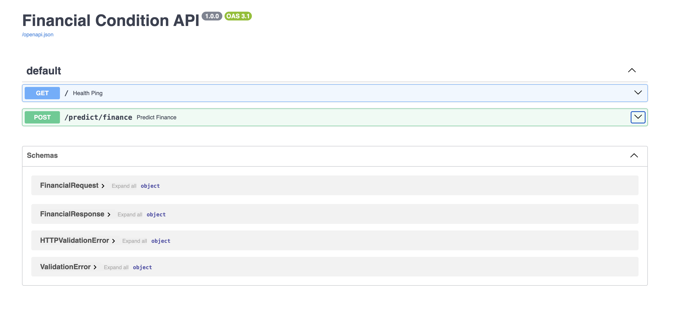
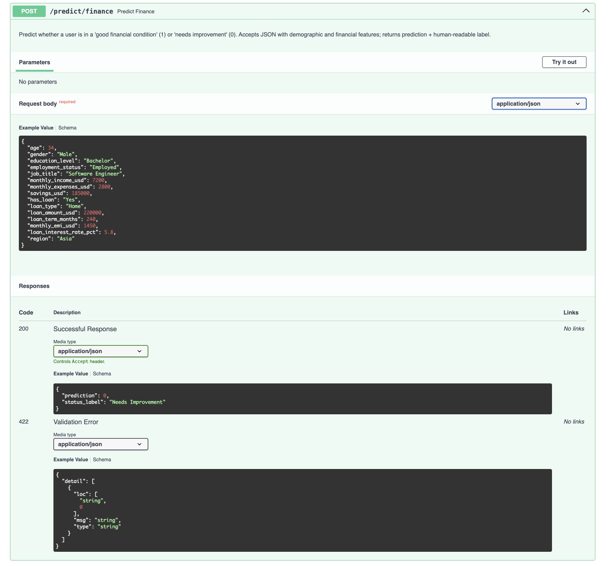

# Lab 3: FastAPI Financial Condition API (Linear Booster)

This lab shows how to train a **linear-booster XGBoost model** on a personal finance dataset and expose it via a **FastAPI** endpoint.

---

## Key Features

- **Training Pipeline**: Loads raw financial data, engineers a synthetic target label, applies `OrdinalEncoder` for categorical variable encoding, and trains a `gblinear` XGBoost model.
- **FastAPI REST Endpoint**: Sets up a web API using FastAPI to serve real-time predictions.
- **Pydantic Validation**: Uses exact data schemas to validate JSON request bodies automatically.
- **Inference Integration**: Handles end-to-end processing, transforming incoming JSON payloads into model-ready features and responding with human-readable financial conditions.

---

## Project Structure

All paths below are relative to `Lab 3 - Fast_API/`:

```text
Lab 3 - Fast_API/
├── README.md
├── requirements.txt            # Python dependencies for this lab
├── data/
│   └── financial_data.csv      # Raw financial dataset (one row per user)
├── model/                      # Created by train.py (model + encoders)
└── src/
    ├── __init__.py
    ├── data.py                 # Loads data/financial_data.csv and splits train / test
    ├── features.py             # Target construction + feature engineering
    ├── train.py                # Trains XGBoost (linear booster) classifier
    ├── test_accuracy.py        # Evaluates trained model on test set
    ├── predict.py              # Loads model + runs inference
    ├── schemas.py              # Pydantic models for request/response
    └── main.py                 # FastAPI application (health + /predict/finance)
```

The trained model and encoders are saved under a `model/` directory (created automatically when you run `src/train.py`).

---

## Setup & Prerequisites

- **Python 3.10+** installed.
- (Optional but recommended) `virtualenv` or `venv` for an isolated environment.

All commands below assume you start from the **MLOps Labs** repo root:

```bash
cd "Lab 3 - Fast_API"
```

1. **Set up the environment:**
   Create and activate a virtual environment (you can reuse the one from previous labs):

   ```bash
   python3 -m venv venv
   source venv/bin/activate        # macOS / Linux
   # venv\Scripts\activate         # Windows PowerShell
   ```

2. **Install dependencies:**
   ```bash
   pip install -r requirements.txt
   ```

3. **Prepare the dataset:**
   Place `financial_data.csv` in the `data/` directory:
   ```bash
   mkdir -p data
   # Copy or download financial_data.csv into data/
   ```
   *(The `data/` folder is listed in `.gitignore` so the CSV is not committed to the repo.)*

---

## How to Run the Lab

### Option 1: Train and Evaluate the Model

The training script loads data, engineers features, ordinal-encodes categories, trains a **linear booster** XGBoost classifier, and saves artifacts under `model/`.

1. **Run the training script:**
   ```bash
   python -m src.train
   ```
   *After completion, you will find `financial_linear_model.pkl`, `categorical_encoder.pkl`, and `financial_feature_columns.joblib` in the `model/` directory.*

2. **Evaluate the model (Optional):**
   ```bash
   python -m src.test_accuracy
   ```
   This will output the test accuracy (e.g., `Test accuracy (Linear Booster): 83.36%`).

### Option 2: Start the FastAPI Server

Once the model is trained, you can start the API.

1. **Start Uvicorn:**
   ```bash
   uvicorn src.main:app --reload
   ```
   *By default, this runs on `http://127.0.0.1:8000`.*

2. **Access the API:**
   - **Health Check:** `GET http://127.0.0.1:8000/` – Returns `{"status": "healthy"}`.
   - **Interactive Docs:** Open `http://127.0.0.1:8000/docs` in your browser. Expand `POST /predict/finance` and click **Try it out**.

   
   *FastAPI interactive documentation at `/docs`*

3. **Stop the server:**
   Press `CTRL + C` in the terminal where Uvicorn is running.

---

## Request and Response Examples

The request body must match the `FinancialRequest` schema, mirroring columns from `financial_data.csv`.

**Example Request Payload:**
```json
{
  "age": 45,
  "gender": "Male",
  "education_level": "Bachelor",
  "employment_status": "Employed",
  "job_title": "Engineer",
  "monthly_income_usd": 5200.0,
  "monthly_expenses_usd": 2100.0,
  "savings_usd": 150000.0,
  "has_loan": "Yes",
  "loan_type": "Home",
  "loan_amount_usd": 180000.0,
  "loan_term_months": 240,
  "monthly_emi_usd": 1200.0,
  "loan_interest_rate_pct": 6.5,
  "region": "Europe"
}
```

**Example Response:**
```json
{
  "prediction": 1,
  "status_label": "Good"
}
```



---

## Lab Completion Summary

In this lab, we successfully implemented and verified the following components:

- **Model Training**: Trained a Linear Booster XGBoost classifier (`gblinear`) which achieved an accuracy of `83.36%`.
- **Feature Engineering**: Used `OrdinalEncoder` for categorical feature transformations and persisted both the model and encoders using `joblib`.
- **FastAPI REST Endpoint**: Exposed a real-time `POST /predict/finance` endpoint.
- **Pydantic Validation**: Ensured type safety using Pydantic `FinancialRequest` and `FinancialResponse` schemas.
- **End-to-end Inference**: Tested the complete flow transforming incoming JSON payloads to numeric matrices to output human-readable labels (`"Good"` or `"Needs Improvement"`).
