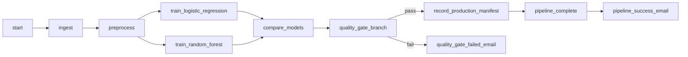

# Lab 5: Apache Airflow — ML Pipeline Orchestration

This lab uses **Apache Airflow** to orchestrate an end-to-end machine learning workflow: load data, preprocess, train **two models in parallel** (logistic regression and random forest), compare them on test accuracy, apply a **quality gate** with branching, then either write a **production manifest** (JSON), finish with a completion task, and send a **success email**, or send a **failure email** if the gate fails.

The **Docker Compose** file follows the official Apache Airflow Docker Compose template (Celery executor, Redis, Postgres). The **DAG**, **dataset**, and **task graph** implement one linear pipeline with a parallel training fork, Wisconsin breast cancer data from `sklearn`, and a JSON **production manifest** on the success path.

---

## Key Features

*   **Orchestration:** Apache Airflow DAG `breast_cancer_training_pipeline` with `PythonOperator`, `BranchPythonOperator`, `BashOperator`, and optional `EmailOperator`.
*   **Data:** Wisconsin breast cancer dataset loaded via `sklearn.datasets` (no external CSV required).
*   **Preprocessing:** `StandardScaler`, stratified train/test split, artifacts persisted under `/opt/airflow/working_data` (mounted as `working_data/` on the host).
*   **Parallel training:** Logistic regression and random forest train on the same preprocessed bundle; `compare_models` picks the higher test accuracy and saves `best_model.pkl` under `/opt/airflow/model` (mounted as `model/`).
*   **Quality gate:** Branch on `QUALITY_THRESHOLD` in `dags/pipeline_dag.py` — pass path writes `working_data/production_manifest.json`, then `pipeline_success_email` notifies you that training completed; fail path sends `quality_gate_failed_email` if SMTP is configured.
*   **Runtime:** Official Airflow **Docker** stack (Celery executor, Redis, PostgreSQL) from the upstream compose template; extra Python deps installed via `_PIP_ADDITIONAL_REQUIREMENTS`.

---

## Project Structure

All paths below are relative to `Lab 5 - Airflow_Labs/`:

```text
Lab 5 - Airflow_Labs/
├── README.md
├── docker-compose.yaml       # Airflow 3.x: API server, scheduler, workers, Redis, Postgres
├── setup.sh                  # Creates logs/plugins/config/working_data/model and a starter .env
├── .env.example              # AIRFLOW_UID, PIPELINE_ALERT_EMAIL, SMTP_*
├── requirements.txt          # For local IDE / lint only; containers use compose env pip line
├── config/                   # Airflow config volume (populated on first init)
├── dags/
│   ├── pipeline_dag.py       # DAG definition: tasks and dependencies
│   └── src/
│       ├── __init__.py
│       └── pipeline_tasks.py # Ingest, preprocess, train, compare, manifest helpers
├── logs/                     # Created at runtime (gitignored)
├── working_data/             # Pickles + production_manifest.json (gitignored)
├── model/                    # Saved .pkl models (gitignored)
└── plugins/                  # Optional Airflow plugins (gitignored)
```

---

## Setup & Prerequisites

1.  **Docker** and **Docker Compose** (v2: `docker compose`) installed.
2.  **Optional:** A Gmail **app password** (or other SMTP) if you want real emails from `quality_gate_failed_email` and `pipeline_success_email`.
3.  From the **MLOps Labs** repository root, open the lab folder:

    ```bash
    cd "Lab 5 - Airflow_Labs"
    ```

---

## How to Run

### Step 1: Create directories and `.env`

```bash
./setup.sh
```

This creates `logs/`, `plugins/`, `config/`, `working_data/`, `model/` and a minimal `.env` with `AIRFLOW_UID` and `AIRFLOW_PROJ_DIR`.

Edit `.env` and add:

*   `PIPELINE_ALERT_EMAIL` — recipient for success and failure alerts.
*   `SMTP_USER` and `SMTP_PASSWORD` — required for real email (see **Enabling SMTP** below).

If you already have a `.env` from an older setup, add `PIPELINE_ALERT_EMAIL` with your notification address (this is the variable the DAG and Compose read).

### Enabling SMTP (fully on)

The compose file already defines connection **`smtp_default`** pointing at **Gmail** (`smtp.gmail.com`, port **587**). To make it live:

1.  **Google account:** Turn on **2-Step Verification** for the Gmail account you will send from.
2.  **App password:** Use [App passwords](https://myaccount.google.com/apppasswords) (or Google Account → **Security** → **App passwords**). Copy the **16-character** password (spaces optional).
3.  **`.env`** next to `docker-compose.yaml`:

    ```bash
    PIPELINE_ALERT_EMAIL=your-inbox@example.com
    SMTP_USER=your.sender@gmail.com
    SMTP_PASSWORD=xxxx xxxx xxxx xxxx
    ```

4.  **Restart** Airflow so workers load the new variables:

    ```bash
    docker compose down
    docker compose up -d
    ```

5.  **Test:** Temporarily set `QUALITY_THRESHOLD = 0.99` in `dags/pipeline_dag.py`, trigger the DAG, and confirm the run takes the **`quality_gate_failed_email`** branch and you receive mail. Set the threshold back when done.

**Note:** This DAG only sends mail on the **quality gate** branch for failure, plus **pipeline_success_email** on the success path — not on arbitrary task failures unless you add that separately. For a non-Gmail provider, change `AIRFLOW_CONN_SMTP_DEFAULT` in `docker-compose.yaml` to match that provider’s host, port, and TLS settings.

### Step 2: Initialize the database

```bash
docker compose up airflow-init
```

Wait until the `airflow-init` container **exits successfully** (exit code 0).

### Step 3: Start Airflow

```bash
docker compose up -d
```

When services are healthy, open **http://localhost:8080**. Default credentials are often `airflow` / `airflow` unless you changed `_AIRFLOW_WWW_USER_USERNAME` / `_AIRFLOW_WWW_USER_PASSWORD` in `docker-compose.yaml`.

### Step 4: Trigger the DAG

1.  Enable **`breast_cancer_training_pipeline`** (toggle **On**).
2.  Start a manual run (**▶** Trigger DAG).
3.  On success, confirm **`working_data/production_manifest.json`** on your machine (same content is under `/opt/airflow/working_data` inside workers).

### Step 5: Stop Airflow

```bash
docker compose down
```

To remove volumes (database data): `docker compose down -v`.

---

## DAG Overview (Graph View)


| Task ID | Role |
| :--- | :--- |
| `start` | Bash echo — run boundary marker |
| `ingest_breast_cancer` | Load sklearn dataset to `raw.pkl` |
| `preprocess_and_split` | Scale + split → `preprocessed.pkl` |
| `train_logistic_regression` / `train_random_forest` | Parallel estimators; results pushed via XCom |
| `compare_models` | Choose best accuracy; save `best_model.pkl` |
| `quality_gate_branch` | `BranchPythonOperator` — next task by threshold |
| `record_production_manifest` | Writes JSON manifest (success path) |
| `pipeline_complete` | Bash echo after manifest |
| `pipeline_success_email` | Email that the training pipeline completed (success path; uses `PIPELINE_ALERT_EMAIL`) |
| `quality_gate_failed_email` | Email on fail path |



---

## Tuning the Quality Gate

In `dags/pipeline_dag.py`, adjust:

```python
QUALITY_THRESHOLD = 0.90
```

Typical test accuracies on this dataset are often **above 90%**, so `0.90` usually **passes** the gate. Set **`0.99`** to **force** the failure branch and exercise the email task without changing the models.

---

## Verification

*   **Airflow UI:** DAG run shows green tasks on the success path; skipped tasks on the branch not taken.
*   **Artifacts:** `working_data/production_manifest.json` lists `best_model`, `accuracy`, and `artifact` path after a successful run.
*   **Logs:** Task logs under `logs/` (host) or the UI **Log** button per task.

---

## Troubleshooting

| Symptom | What to try |
| :--- | :--- |
| Permission errors on `logs/` or `working_data/` | Re-run `./setup.sh`. On Linux, ensure `AIRFLOW_UID` in `.env` equals `id -u`. |
| `quality_gate_failed_email` fails | Set `SMTP_USER` / `SMTP_PASSWORD`, or raise `QUALITY_THRESHOLD` so the DAG never routes to the email task while debugging. |
| Import error for `src.pipeline_tasks` | Keep `dags/src/__init__.py` in place; mount only this `dags/` tree to `/opt/airflow/dags`. |

---

## Clean up

```bash
docker compose down
```

Optionally `docker compose down -v` to drop Postgres/Redis volumes. Remove local `working_data/` and `model/` if you want a clean slate.

---

## Reference

*   [Running Airflow in Docker](https://airflow.apache.org/docs/apache-airflow/stable/howto/docker-compose/index.html) — official Apache Airflow documentation.

---

## Lab Completion Summary

In this lab, you:

*   **Orchestrate** a full ML workflow with Apache Airflow (ingest → preprocess → parallel training → compare → branch).
*   **Train** two sklearn classifiers on the same preprocessed data and **select** the better model by test accuracy.
*   **Implement** a **quality gate** with `BranchPythonOperator`, routing to either a **manifest file** or an **email** notification, plus a **success email** when the run completes on the pass path.
*   **Run** the stack locally with **Docker Compose** and verify outputs under `working_data/` and the Airflow UI.
