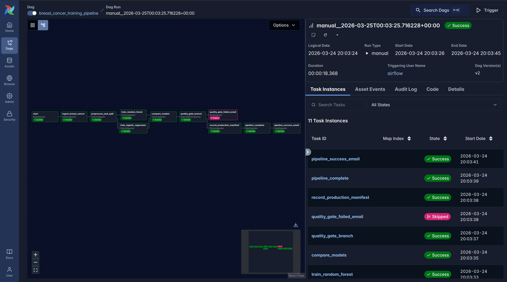
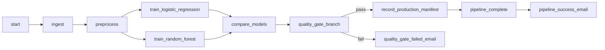

# Lab 5: Apache Airflow — ML Pipeline Orchestration

This lab uses **Apache Airflow** to orchestrate an end-to-end machine learning workflow: load data, preprocess, train **two models in parallel** (logistic regression and random forest), compare them on test accuracy, apply a **quality gate** with branching, then either write a **production manifest** (JSON), finish with a completion task, and send a **success email**, or send a **failure email** if the gate fails.

---

## Key Features

*   **Orchestration:** Apache Airflow DAG `breast_cancer_training_pipeline` with `PythonOperator`, `BranchPythonOperator`, `BashOperator`, and optional `EmailOperator`.
*   **Data:** Wisconsin breast cancer dataset loaded via `sklearn.datasets` (no external CSV required).
*   **Preprocessing:** `StandardScaler`, stratified train/test split, artifacts persisted under `/opt/airflow/working_data`.
*   **Parallel Training:** Logistic regression and random forest train on the same preprocessed bundle; `compare_models` picks the higher test accuracy and saves `best_model.pkl` under `/opt/airflow/model`.
*   **Quality Gate:** Branch on `QUALITY_THRESHOLD` in `dags/pipeline_dag.py` — pass path writes `working_data/production_manifest.json`, then `pipeline_success_email` notifies you that training completed; fail path sends `quality_gate_failed_email` if SMTP is configured.

---

## Technologies Used

*   **Orchestration:** Apache Airflow (Celery Executor, Redis, PostgreSQL)
*   **Containerization:** Docker & Docker Compose
*   **Machine Learning:** Scikit-learn (Wisconsin Breast Cancer dataset)
*   **Programming Language:** Python 3.10+
*   **Data Handling:** Pandas, NumPy
*   **Persistence:** Pickle (.pkl) for models and data, JSON for manifests

---

## Project Structure

All paths below are relative to `Lab 5 - Airflow_Labs/`:

```text
Lab 5 - Airflow_Labs/
├── README.md
├── docker-compose.yaml       # Airflow 3.x: API server, scheduler, workers, Redis, Postgres
├── setup.sh                  # Creates logs/plugins/config/working_data/model and a starter .env
├── .env.example              # AIRFLOW_UID, PIPELINE_ALERT_EMAIL, SMTP_*
├── requirements.txt          # For local IDE / lint only; containers use compose env pip line
├── config/                   # Airflow config volume (populated on first init)
├── dags/
│   ├── pipeline_dag.py       # DAG definition: tasks and dependencies
│   └── src/
│       ├── __init__.py
│       └── pipeline_tasks.py # Ingest, preprocess, train, compare, manifest helpers
├── logs/                     # Created at runtime (gitignored)
├── working_data/             # Pickles + production_manifest.json (gitignored)
├── model/                    # Saved .pkl models (gitignored)
├── plugins/                  # Optional Airflow plugins (gitignored)
└── images/
    └── airflow.png           # Pipeline graph screenshot
```

---

## Setup & Prerequisites

1.  **Docker** and **Docker Compose** (v2: `docker compose`) installed.
2.  From the **MLOps Labs** repository root, open the lab folder:

    ```bash
    cd "Lab 5 - Airflow_Labs"
    ```

---

## How to Run the Lab

### Step 1: Initialize the environment

Run the setup script to create local directories and a starter `.env` file (this sets the `AIRFLOW_UID` to your current user):

```bash
chmod +x setup.sh
./setup.sh
```

### Step 2: Configure SMTP (Optional for Email Alerts)

To receive success/failure emails, you need to configure an SMTP sender (we recommend **Gmail**).

1.  **Enable 2-Step Verification:** Go to your [Google Account Security](https://myaccount.google.com/security).
2.  **Generate App Password:** Navigate to [App Passwords](https://myaccount.google.com/apppasswords).
3.  **Select App & Device:** Choose **'Mail'** and your current device (or **'Other'** and name it 'Airflow').
4.  **Copy Code:** Copy the generated **16-character password** (e.g., `xxxx xxxx xxxx xxxx`).
5.  **Update `.env`**: Edit your local `.env` file with these values:

```bash
PIPELINE_ALERT_EMAIL=your-recipient@example.com  # Where alerts go
SMTP_USER=your.sender@gmail.com                 # Your Gmail address
SMTP_PASSWORD=your-16-character-app-password    # No spaces needed
```

> [!TIP]
> This DAG uses the default Airflow connection ID `smtp_default`, which is pre-configured in `docker-compose.yaml` to use Gmail (port 587, TLS).

### Step 3: Initialize the Airflow Database

Only required once to initialize the metadata database:

```bash
docker compose up airflow-init
```

Wait until the `airflow-init` container **exits successfully** (exit code 0).

### Step 4: Start the Airflow Stack

Launch all services in detached mode:

```bash
docker compose up -d
```

When services are healthy, open **http://localhost:8080** in your browser. Default credentials are `airflow` / `airflow`.

### Step 5: Trigger the DAG

1.  Enable **`breast_cancer_training_pipeline`** (toggle **On**).
2.  Start a manual run (**▶** Trigger DAG).
3.  Monitor the graph view as tasks transition from **queued** (gray) to **running** (light green) and **success** (dark green).

---

## DAG Overview (Graph View)

The DAG implements a linear pipeline with a parallel training fork and a branch-based quality gate.



| Task ID | Role |
| :--- | :--- |
| `start` | Bash echo — run boundary marker |
| `ingest_breast_cancer` | Load sklearn dataset to `raw.pkl` |
| `preprocess_and_split` | Scale + split → `preprocessed.pkl` |
| `train_logistic_regression` / `train_random_forest` | Parallel estimators; results pushed via XCom |
| `compare_models` | Choose best accuracy; save `best_model.pkl` |
| `quality_gate_branch` | `BranchPythonOperator` — next task by threshold |
| `record_production_manifest` | Writes JSON manifest (success path) |
| `pipeline_complete` | Bash echo after manifest |
| `pipeline_success_email` | Email on success path (uses `PIPELINE_ALERT_EMAIL`) |
| `quality_gate_failed_email` | Email on fail path |



---

## Verification & Artifacts

1.  **Airflow UI:** Confirm the DAG run is green. Check the **Graph View** to see which branch was taken.
2.  **Models Folder:** Verify `model/best_model.pkl` exists on your host machine.
3.  **Data Folder:** Confirm `working_data/production_manifest.json` exists. It should look like this:
    ```json
    {
      "model_type": "random_forest",
      "test_accuracy": 0.96,
      "artifact_path": "/opt/airflow/model/best_model.pkl",
      "timestamp": "..."
    }
    ```
4.  **Logs:** Check `logs/dag_processor/` or `logs/dag_id=...` for troubleshooting.

---

## Tuning the Quality Gate

The quality gate ensures only models meeting a performance threshold proceed to "production" (the manifest record task). In `dags/pipeline_dag.py`, adjust:

```python
QUALITY_THRESHOLD = 0.90
```

*   **Pass:** Set to `0.90` (Passes usually; writes manifest).
*   **Fail:** Set to **`0.99`** (Forces the failure branch; skip manifest, send fail mail).

---

## Troubleshooting

| Symptom | What to try |
| :--- | :--- |
| Permission errors on `logs/` or `working_data/` | Re-run `./setup.sh`. Ensure `AIRFLOW_UID` in `.env` matches your local `id -u`. |
| `quality_gate_failed_email` fails | Ensure `SMTP_USER` / `SMTP_PASSWORD` are set correct, or use Gmail "App Passwords". |
| Import error for `src.pipeline_tasks` | Keep `dags/src/__init__.py` in place; ensuring the module is loadable by the worker. |

---

## Clean up

```bash
docker compose down
```

To wipe the database and artifacts for a fresh start:
```bash
docker compose down -v
rm -rf working_data/* model/*
```

---

## Lab Completion Summary

*   **Orchestrated** a full ML workflow using Apache Airflow, managing complex task dependencies and branching logic.
*   **Implemented Parallelism** by training multiple models simultaneously using Airflow's internal task distribution.
*   **Applied a Quality Gate** to enforce model performance standards before updating the production manifest.
*   **Integrated Artifact Management** to persist models and data across container runs and host volumes.
*   **Configured Alerting** through automated emails for both pipeline success and quality failures.
